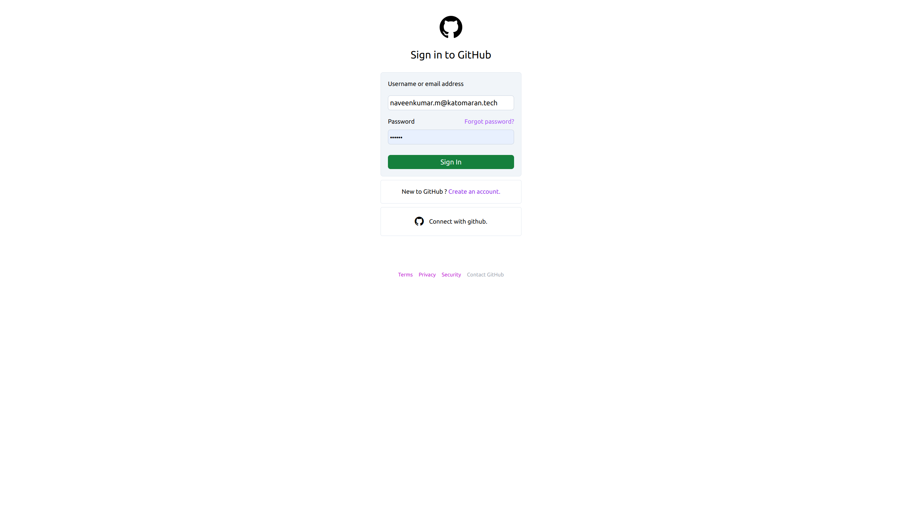
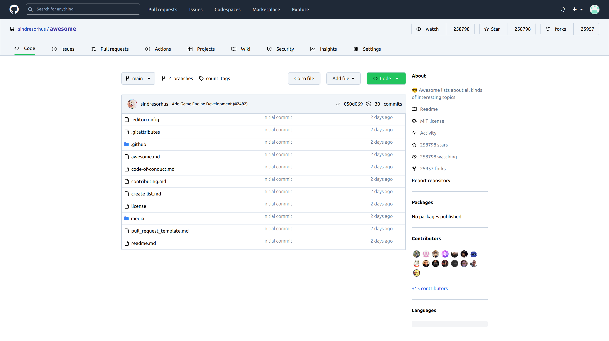

# Getting Started with Create React App

This project was bootstrapped with [Create React App](https://github.com/facebook/create-react-app).

## Available Scripts

In the project directory, you can run:

### `npm start`

Runs the app in development mode.\
Open [http://localhost:3000](http://localhost:3000) to view it in your browser.

## Login Page:

path is "/login".

Screenshots:

## OAthu Page:

Screenshots:

## Main Page:

path is "/repos".

trending tab Screenshots:

path is "/repos/details".

trending tab Screenshots:

developers tab Screenshots:

## Error Page:

Screenshots:

